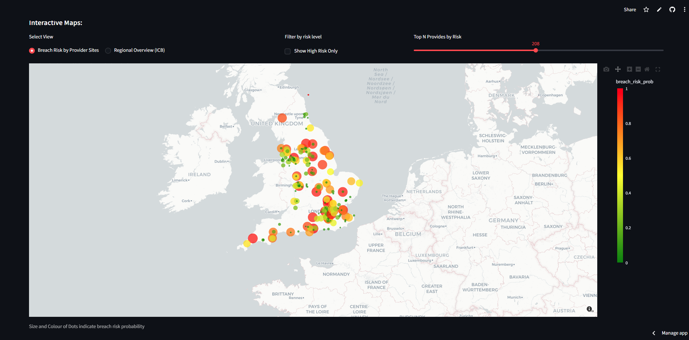

# NHS Diagnostic Breach Risk Dashboard

An interactive Streamlit dashboard visualising predicted NHS diagnostic breach risk for March 2026, based on December 2025 provider-level diagnostic data.

🔗 **[Live Dashboard]([your-streamlit-url](https://nhsbreachriskdashboard-axe86jhoappatmt6uhcbsuk.streamlit.app/))**
https://nhsbreachriskdashboard-axe86jhoappatmt6uhcbsuk.streamlit.app/

## Features
- **ICB Choropleth Map** — regional breach risk across 36 NHS Integrated Care Boards
- **Provider Scatter Map** — individual trust breach risk with filters for high risk providers
